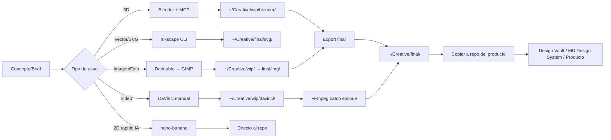

# Agencia de Diseño — MD Consultoría SC
## Punto de entrada para assets visuales de todos los productos

Esta agencia coordina los recursos de diseño visual disponibles en el ecosistema de MD Consultoría. Cuando cualquier producto necesite assets visuales, componentes de UI, o referencia de diseño, este documento es el punto de entrada.

---

## Componentes de la Agencia

### 1. MD Design System (este proyecto)
**Ruta:** `~/Projects/md-design-system/`
**Función:** Tokens de diseño, componentes base, sistema tipográfico y cromático de MD Consultoría.
**Cuándo usar:** Siempre que se cree un nuevo producto o se actualice la UI de uno existente. Los tokens aquí son la fuente de verdad para colores, tipografía y espaciado.

### 2. Design Vault
**Ruta:** `~/Projects/design-vault/design-vault/`
**Función:** Galería curada de las mejores landing pages, dashboards, portfolios y experiencias 3D open source. Funciona como biblioteca de referencia visual y playground para replicar componentes.
**Stack:** Next.js 15 + Tailwind 4 + shadcn/ui + R3F + Lenis
**Cuándo usar:** Cuando necesites inspiración visual, patrones de UI probados, o componentes de referencia para adaptar. No es código de producción — es referencia.

### 3. Alebrije 3D Creator
**Ruta:** `~/Projects/alebrije-3d-creator/`
**Función:** Pipeline de Blender para generar assets 3D (alebrijes, modelos culturales). Incluye scripts Python para generación automatizada.
**Pipeline:** `blender/pipeline/alebrije_conejo_neon.py` + PIPELINE.md
**Pendiente:** Ruta B (Tripo3D/Meshy import), Geometry Nodes, patrones tribales.
**Cuándo usar:** Cuando Guelaguetza Connect o Cultura México necesiten modelos 3D. Requiere Blender instalado.

### 4. nano-banana (Skill de Claude Code)
**Ruta:** `~/.claude/skills/nano-banana-pro`
**Función:** Generación de imágenes con IA. Técnica dual-fondo para transparencias documentada.
**Cuándo usar:** Assets 2D rápidos (iconos, ilustraciones, fondos) que no justifiquen pipeline 3D.

### 5. Lenis Replica (pendiente de integración)
**Ruta:** `~/Projects/lenis-replica/`
**Función:** Réplica de Lenis smooth scroll para Next.js. Debe integrarse como componente de este Design System.
**Stack:** Next.js + Tailwind

---

## Skills de Claude Code relacionadas

| Skill | Ruta | Uso |
|-------|------|-----|
| react-three-fiber | `~/.claude/skills/react-three-fiber/` | Escenas 3D en React |
| gsap | `~/.claude/skills/gsap/` | Animaciones complejas |
| framer-motion | `~/.claude/skills/framer-motion/` | Animaciones declarativas |
| threejs | `~/.claude/skills/threejs/` | Three.js directo |
| shadcn-ui | `~/.claude/skills/shadcn-ui/` | Componentes UI base |
| tailwind-design-system | `~/.claude/skills/tailwind-design-system/` | Tokens Tailwind |
| frontend-design | `~/.claude/skills/frontend-design/` | Diseño frontend general |
| landing-page-factory | `~/.claude/skills/landing-page-factory/` | Generación de landings |

---

---

### 6. Pipeline Creativo Pro (NUEVO — abril 2026)
**Funcion:** Herramientas de produccion offline para assets que las tools web no cubren.
**Maquina target:** Mac Mini M4 (16GB) — iMac M3 (8GB) para edicion ligera.
**Cross-audit:** Validado por 3 fuentes externas. Tiered por factibilidad.

#### Tiers de instalacion

| Tier | App | Funcion | Automatizable | Estado |
|------|-----|---------|---------------|--------|
| 1 - Inmediato | **Blender + MCP 134 tools** | 3D, compositing, video | Si (MCP ya probado por CEO) | Pendiente instalar |
| 1 - Inmediato | **FFmpeg** | Batch processing, encoding | Si (CLI nativa) | Verificar version |
| 1 - Inmediato | **Inkscape** | Vectores SVG profesionales | Si (`--export-type`, `--export-filename`) | Pendiente instalar |
| 2 - Viable | **GIMP** | Edicion de imagen | Parcial (Script-Fu wrapper, alto esfuerzo) | Pendiente instalar |
| 2 - Viable | **Darktable** | Revelado RAW, estilo Lightroom | Parcial (`darktable-cli` limitada) | Pendiente instalar |
| 3 - Manual | **DaVinci Resolve** | Grading, editing, VFX, audio | No (solo scripting Lua/Python interno, sin API headless) | Pendiente instalar |
| 3 - Manual | **Natron** | Compositing/VFX (tipo Nuke, NO motion graphics) | No (GUI-heavy) | Pendiente verificar Apple Silicon |

> **Nota:** Motion graphics (tipo After Effects) ya esta cubierto por **Remotion** en este proyecto (`src/remotion/`). Natron es compositing de capas y VFX pesado — no es lo mismo.

> **Nota:** DaVinci Resolve se usa como "manual con asistencia de prompts". Claude Code puede generar scripts Lua/Python para ejecutar dentro de DaVinci, pero no puede operarlo headless.

#### Gestion de color

Para consistencia visual entre apps del pipeline, usar perfil de color unificado:
- **OCIO/ACES** como color management compartido entre Blender, Darktable y DaVinci Resolve
- Lo que sale de una app debe verse igual en la siguiente
- Documentar el perfil activo en cada proyecto que use multiples apps

#### Puntos de montaje (WIP fuera de Git)

Assets pesados en proceso NO van al repo. Estructura:

```
~/Creative/
├── wip/                    # Work in progress (temporal)
│   ├── blender/            # .blend files, renders intermedios
│   ├── davinci/            # Proyectos DaVinci Resolve
│   ├── raw/                # Fotos RAW para Darktable
│   └── exports/            # Exports intermedios
├── final/                  # Assets finales listos para repo
│   ├── svg/                # Vectores finales (Inkscape)
│   ├── img/                # Imagenes finales (GIMP/Darktable)
│   ├── video/              # Videos finales (DaVinci/FFmpeg)
│   └── 3d/                 # Modelos exportados (Blender)
└── reference/              # Material de referencia, moodboards
```

**Regla:** Solo el contenido de `~/Creative/final/` se copia a repos de productos. Nunca commitear archivos de `wip/`.

#### Flujo de assets (Mermaid)



#### Smoke test post-instalacion

Script que verifica operacion minima por app:

```bash
#!/bin/bash
# ~/Creative/smoke-test.sh
echo "=== Smoke Test Pipeline Creativo ==="

# Tier 1
echo -n "Blender: "; blender --version 2>/dev/null && echo "PASS" || echo "FAIL"
echo -n "FFmpeg:  "; ffmpeg -version 2>/dev/null | head -1 && echo "PASS" || echo "FAIL"
echo -n "Inkscape:"; inkscape --version 2>/dev/null && echo "PASS" || echo "FAIL"

# Tier 2
echo -n "GIMP:    "; gimp --version 2>/dev/null && echo "PASS" || echo "FAIL"
echo -n "Darktable:"; darktable-cli --version 2>/dev/null && echo "PASS" || echo "FAIL"

# Tier 3
echo -n "DaVinci: "; ls /Applications/DaVinci\ Resolve/DaVinci\ Resolve.app 2>/dev/null && echo "INSTALLED" || echo "NOT FOUND"
echo -n "Natron:  "; natron --version 2>/dev/null && echo "PASS" || echo "FAIL"

# Operaciones minimas
echo ""; echo "=== Operaciones Minimas ==="
echo -n "Blender render cubo: "
blender -b --python-expr "import bpy; bpy.ops.render.render(write_still=True)" -o /tmp/smoke-cube.png -f 1 2>/dev/null && echo "PASS" || echo "FAIL"

echo -n "FFmpeg transcode: "
ffmpeg -f lavfi -i testsrc=duration=1:size=320x240:rate=1 -y /tmp/smoke-test.mp4 2>/dev/null && echo "PASS" || echo "FAIL"

echo -n "Inkscape SVG→PNG: "
echo '<svg xmlns="http://www.w3.org/2000/svg" width="100" height="100"><rect width="100" height="100" fill="red"/></svg>' > /tmp/smoke-test.svg
inkscape /tmp/smoke-test.svg --export-type=png --export-filename=/tmp/smoke-test.png 2>/dev/null && echo "PASS" || echo "FAIL"

echo ""; echo "=== Smoke Test Completo ==="
```

---

### 7. CLI-Anything — Puente Agente-Apps (NUEVO — abril 2026)
**Repo:** `HKUDS/CLI-Anything`
**Funcion:** Convierte cualquier software GUI en CLI agent-native que Claude Code puede operar.
**Donde vive:** `~/.claude/` (plugin + CLIs generadas en skills)

#### Tiers de factibilidad

| Tier | App | Metodo | Ejemplo de uso |
|------|-----|--------|----------------|
| 1 - Ya funciona | Blender | MCP 134 tools (no necesita CLI-Anything) | `mcp_blender("render scene con iluminacion HDRI")` |
| 1 - Ya funciona | FFmpeg | CLI nativa | `ffmpeg -i input.mov -c:v libx264 output.mp4` |
| 2 - CLI-Anything viable | Inkscape | Wrap CLI nativa | `cli-anything-inkscape "convierte logo.svg a PNG 1024px con fondo transparente"` |
| 3 - Alto esfuerzo | GIMP | Wrap Script-Fu | `cli-anything-gimp "aplica filtro neon a logo.png"` |
| 3 - Alto esfuerzo | Darktable | Wrap darktable-cli | Diferido hasta necesidad real |
| No aplica | DaVinci Resolve | Sin API headless | Manual con prompts de scripting Lua/Python |
| No aplica | Natron | GUI-heavy | Manual |

#### Instalacion

```bash
# Instalar como plugin de Claude Code
/plugin marketplace add HKUDS/CLI-Anything
/plugin install cli-anything

# Generar CLIs solo para apps viables (Tier 2+)
/cli-anything inkscape
# Luego instalar: cd inkscape/agent-harness && pip install -e .
```

> **Regla:** No generar CLIs para apps Tier 3+ hasta que haya un caso de uso concreto que lo justifique. Blender ya tiene MCP. FFmpeg ya es CLI. Inkscape es el primer candidato real para CLI-Anything.

---

### 8. Pipeline Blender Headless PBR (PROBADO — abril 2026)

**Estado:** FUNCIONAL — probado en produccion con ArquiMX
**Blender:** 5.0.1 (`/opt/homebrew/bin/blender`)
**CLI wrapper:** `cli-anything-blender` (pip, en PATH)
**Motor:** Cycles GPU (Apple Metal)
**Primer caso de uso:** Casa colonial mexicana para landing page de ArquiMX

#### Pipeline probado

```
Script bpy (Python)
    │
    ├── 1. Geometria (mesh.primitive_cube_add, cylinder, etc.)
    ├── 2. Materiales PBR procedurales (ShaderNodeTexNoise, Wave, Voronoi)
    ├── 3. Iluminacion (Sun golden hour + Area fill + rim)
    ├── 4. Camera (DOF, lens, position)
    ├── 5. World (gradient sky via ShaderNodeTexGradient + ColorRamp)
    │
    ├── Render Cycles GPU → PNG (256 samples, denoising)
    └── Export GLB (Draco compression) → 85KB web-ready
```

#### Materiales PBR procedurales disponibles

| Material | Tecnica | Nodos | Uso |
|----------|---------|-------|-----|
| Stucco/Plaster | Noise + Bump | TexNoise → ColorRamp → BSDF + Bump | Paredes exteriores |
| Barrel Tile | Wave bands + Bump | TexWave → ColorRamp → BSDF + Bump | Techos coloniales |
| Cantera/Stone | Voronoi F1 + Bump | TexVoronoi → ColorRamp → BSDF + Bump | Zocalos, bases |
| Wood Grain | Wave + Noise mix | TexWave + TexNoise → MixRGB → ColorRamp | Puertas, marcos |
| Terracotta Tile | Checker + Noise | TexChecker + TexNoise → MixRGB → BSDF | Pisos |
| Grass/Ground | Noise multi-stop | TexNoise → ColorRamp (3 stops) + Bump | Terreno |
| Iron | Simple PBR | Metallic 0.85, Roughness 0.4 | Herreria |
| Glass | Semi-transparent | Alpha 0.4, IOR 1.5, Roughness 0.05 | Ventanas |

#### Comandos de ejecucion

```bash
# Render PNG (256 samples, Cycles GPU, denoising)
/opt/homebrew/bin/blender --background --python script.py

# Export GLB con Draco
bpy.ops.export_scene.gltf(
    filepath="output.glb",
    export_format='GLB',
    export_draco_mesh_compression_enable=True,
    export_draco_mesh_compression_level=6,
)

# Render clay (swap all materials to uniform white)
# Util para before/after comparisons
```

#### Tiempos medidos (Mac Mini M4)

| Operacion | Tiempo | Output |
|-----------|--------|--------|
| Render 128 samples 1200x750 | ~15s | PNG ~200KB |
| Render 256 samples 1400x875 | ~30s | PNG ~250KB |
| Export GLB con Draco | ~2s | GLB 85KB |
| Clay render (materiales simples) | ~10s | PNG ~150KB |

#### Integracion con productos web

El GLB exportado se usa directamente en React con R3F:

```tsx
import { Canvas } from "@react-three/fiber";
import { OrbitControls, Environment, useGLTF } from "@react-three/drei";

function Model() {
  const { scene } = useGLTF("/landing/house-colonial.glb");
  return <primitive object={scene} />;
}

// Resultado: modelo 3D interactivo en la landing page
// El usuario puede rotar con mouse/touch
// Auto-rotate con OrbitControls autoRotate
```

#### Scripts de referencia

| Script | Funcion | Producto |
|--------|---------|----------|
| `/tmp/render-pbr-house.py` | Casa colonial PBR completa | ArquiMX |
| `/tmp/export-house-glb.py` | Export GLB con Draco | ArquiMX |
| `/tmp/render-before-after.py` | Clay vs textured comparison | ArquiMX |

> **TODO:** Mover scripts a `~/Creative/scripts/blender/` para persistencia.
> **TODO:** Configurar Blender MCP (134 tools) como MCP server para control interactivo.
> **TODO:** Pipeline TRELLIS: importar GLB → re-texturizar con PBR procedurales → bake → export.

---

## Flujo de trabajo (actualizado)

1. **Referencia:** Consultar Design Vault para patrones e inspiracion
2. **Tokens:** Usar MD Design System para colores, tipografia, espaciado
3. **2D rapido:** nano-banana para assets con IA
4. **3D:** Blender + MCP (agente) o Alebrije 3D Creator (pipeline)
5. **Vectores:** Inkscape (CLI o CLI-Anything)
6. **Imagen:** GIMP + Darktable (manual o parcialmente automatizado)
7. **Video:** DaVinci Resolve (manual) + FFmpeg (batch encoding agente)
8. **VFX/Compositing:** Natron (manual, solo proyectos que lo requieran)
9. **Motion graphics web:** Remotion (ya integrado en este proyecto)
10. **Animacion web:** GSAP + Framer Motion + Lenis
11. **Componentes:** shadcn/ui como base, personalizar con tokens MD
